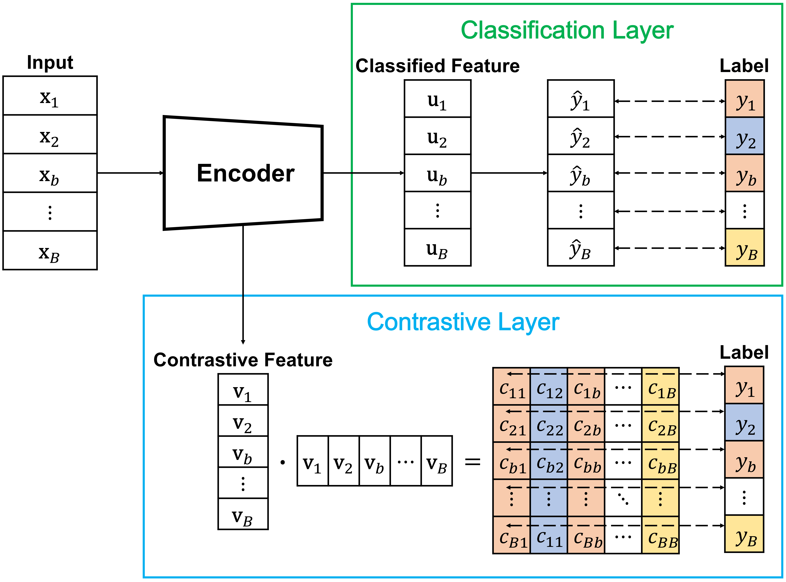

# Joint Contrastive and Supervised Learning in Human Activity Recognition


## Overview
[Supervised Contratstive Learning](https://proceedings.neurips.cc/paper/2020/hash/d89a66c7c80a29b1bdbab0f2a1a94af8-Abstract.html) (SupCon) is a contrastive learning method that can be used in a supervised learning setting. SupCon has two part of training which are contrastive phase (pretext) and supervised phase (fine tuning). In contrastive phase, the encoder learns representation of inputs by class label. 

We propose a **joint contrastive and supervised learning** (**Joint SupCon**) method for human activity recognition. We apply SupCon to the encoder of the previous works jointly and show that the proposed method can improve the performance of the previous works.



## How to use
1. Clone the repository
```bash
$ git clone https://github.com/dongin1009/joint_supcon_har
$ cd joint_supcon_har
```

2. Install tensorflow 2.9, numpy 1.23.4, sklearn

3. Get [PAMAP2 dataset](https://archive.ics.uci.edu/ml/datasets/pamap2+physical+activity+monitoring) and [WISDM dataset](https://www.cis.fordham.edu/wisdm/includes/datasets/latest/WISDM_at_latest.tar.gz) (Actitracker version) and put them in the `data` directory.

4. Preprocess the data
```python
$ python data_preprocess.py --dataset pamap2 --time_step 100 --overlap_step 50
$ python data_preprocess.py --dataset wisdm --time_step 200 --overlap_step 100
```

5. Train the model
```python
$ python train.py --dataset pamap2 --model deepconvlstm --train_type joint_supcon --epochs 100 --lr 0.005 --alpha 0.2 --batch_size 64
# or other options
$ python train.py --dataset {pamap2, wisdm} --model {deepconvlstm, self_attention, multibranch} --train_type {supervised, supcon, joint_supcon} --epochs EPOCH --lr LR --alpha ALPHA --batch_size BATCH_SIZE
```

## Models
We evaluate our methods based on following models as an encoder. These models are well-performed models in the previous works and we apply our methods to these models.
### *DeepConvLSTM* (M1)
"[Deep ConvLSTM with self-attention for human activity decoding using wearables](https://ieeexplore.ieee.org/document/9296308)", S. P. Singh et al., 2021, IEEE Sensors Journal, [[Code](https://github.com/isukrit/encodingHumanActivity)]

### *Self-Attention* (M2)
"[Human Activity Recognition from Wearable Sensor Data Using Self-Attention](https://ebooks.iospress.nl/publication/55031)", Saif Mahmud et al., 2020, 24th European Conference on Artificial Intelligence (ECAI 2020), [[Code](https://github.com/saif-mahmud/self-attention-HAR)]

### *Multibranch* (M3)
"[A multibranch CNN-BiLSTM model for human activity recognition using wearable sensor data](https://link.springer.com/article/10.1007/s00371-021-02283-3)", Challa, S.K. et al., 2022, The Visual Computer


## Results
These results are averaged results on 5 random seeds.

### PAMAP2 dataset

|PAMAP2           |  supervised   |||    supcon     |||  joint supcon   |||
| --------------- | --------------- | :---------------: | :---------------: | --------------- | :---------------: | :---------------: | --------------- | :---------------: | :---------------: |
|    **Model**    |**lr \|\| alpha**|    **acc**      |   **f1-score**  |**lr \|\| alpha**|    **acc**      |   **f1-score**  |**lr \|\| alpha**|    **acc**      |   **f1-score**  |
|  *DeepConvLSTM* |  0.005 \|\| -  |  0.9116  |  0.9095  |  0.005 \|\| 0.2  |***0.9202***|  0.9175  |  0.005 \|\| 0.2  |  0.9180  |***0.9185***|
|*Self-Attention*|  0.001 \|\| -  |  0.9565  |  0.9545  |  0.001 \|\| 0.2  |  0.9612  |  0.9602  |  0.001 \|\| 0.2  |***0.9636***|***0.9616***|
| *MultiBranch* |  0.001 \|\| -  |  0.9722  |  0.9712  |  0.003 \|\| 0.8  |  0.9751  |***0.9733***|     0.001 \|\| 0.5  |***0.9780***|  0.9711  |

We show the confusion matrix of the each model in PAMAP2 test set. The confusion matrix of the each method is shown below.


We extract the embedding of the contrastive learning layer in PAMAP2 test set and visualize it using t-SNE. The visualization results are shown below.


### WISDM dataset
|WISDM            |  supervised   |||    supcon     |||  joint supcon   |||
| --------------- | --------------- | :---------------: | :---------------: | --------------- | :---------------: | :---------------: | --------------- | :---------------: | :---------------: |
|    **Model**    |**lr \|\| alpha**|    **acc**      |   **f1-score**  |**lr \|\| alpha**|    **acc**      |   **f1-score**  |**lr \|\| alpha**|    **acc**      |   **f1-score**  |
|  *DeepConvLSTM* |  0.003 \|\| -  |  ***0.9363***  |  ***0.9135***  |  0.003 \|\| 0.5  |  0.9132  |  0.8805  |  0.003 \|\| 0.5  |  0.9362  |  0.9111  |
|*Self-Attention*|  0.001 \|\| -  |  0.9097  |  0.8740 |  0.001 \|\| 0.5  |  0.9133  |  0.8837  |  0.001 \|\| 0.5  |***0.9246***|***0.8978***|
| *MultiBranch* |  0.003 \|\| -  |  0.9565  |  0.9421  |  0.005 \|\| 0.2  |  0.9705  |  0.9608  |     0.003 \|\| 0.2  |***0.9723***|***0.9644***|

We show the confusion matrix of the each model in WISDM test set. The confusion matrix of the each method is shown below.


We extract the embedding of the contrastive learning layer in WISDM test set and visualize it using t-SNE. The visualization results are shown below.


## Citation
TBD

## Contact
If you have any questions, please contact us via email: [dongin1009@gmail.com](mailto:dongin1009@gmail.com)